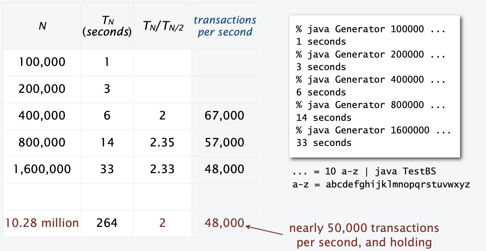

# 二分查找

## 一、核心原理与适用场景

二分查找是一种高效的查找算法，**仅适用于已排序的数组**，核心思想是通过**不断将查找范围减半**缩小目标位置：

1. 初始范围为整个数组（左边界`lo=0`，右边界`hi=n-1`）。
2. 计算中间位置`mid = (lo + hi) / 2`，将目标值与`a[mid]`比较：
   - 若目标值等于`a[mid]`，找到目标，返回索引`mid`。
   - 若目标值小于`a[mid]`，则目标在左半部分（调整右边界`hi=mid-1`）。
   - 若目标值大于`a[mid]`，则目标在右半部分（调整左边界`lo=mid+1`）。
3. 重复步骤 2，直到`lo > hi`（目标不存在），返回`-1`。

**优势**：时间复杂度为**O(log n)**，远优于顺序查找的 O (n)，尤其适合大规模数据（如百万级以上元素）。
**局限性**：依赖数组的**有序性**，若数据频繁变动（需频繁插入 / 删除），维护排序的成本可能高于查找收益。

## 二、与顺序查找的对比分析

| 维度              | 顺序查找（Sequential Search） | 二分查找（Binary Search）   |
| ----------------- | ----------------------------- | --------------------------- |
| 数据要求          | 无需排序                      | 必须按升序 / 降序排列       |
| 时间复杂度        | O (n)（线性增长）             | O (log n)（对数增长）       |
| 适用场景          | 小规模数据、无序数据          | 大规模数据、静态有序数据    |
| 实际性能（N=10⁶） | 约需 10⁶次比较                | 仅需约 20 次比较（2¹⁰≈10⁶） |

## 三、 性能测试与结果

通过测试客户端对比两种查找算法在不同规模数据上的性能：

- **测试场景**：对长度为 N 的有序数组执行 10N 次随机查找。
- **结果（单位：秒）**：

- 结论：随着 N 增大，二分查找的效率优势呈指数级扩大。

