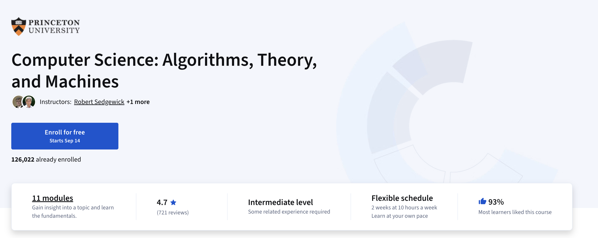

## CSATM

本课程面向具备基础 Java 编程知识的学习者，介绍计算机科学这一更广泛的学科领域。我们的初衷是揭开计算的神秘面纱，让学习者了解计算机科学领域深厚的知识根基与丰富的发展历史，同时着重强调应用编程、计算理论、实际计算机系统及学科历史与发展演变之间的关联，并介绍布尔、香农、图灵、冯・诺依曼等学者的贡献本质。 

课程内容将分模块逐步展开：首先结合现代应用场景，介绍经典算法及用于评估算法性能的科学方法；接着引入经典理论模型，借助这些模型解答计算领域的核心问题（如可计算性、通用性与难解性）；最后围绕机器架构（包括机器语言编程及其与 Java 编程的关联）和逻辑设计（包括从零构建完整的 CPU 设计）深入讲解。

## 索引表

| 序号 | 章节                  | 教材     | 代码                                               | Web资源                                                      | 笔记                                                         |
| ---- | --------------------- | -------- | -------------------------------------------------- | ------------------------------------------------------------ | ------------------------------------------------------------ |
| 02   | Sorting and Searching | P535-565 | <a href="02 - Sorting and Searching/code">code</a> | <a href="https://introcs.cs.princeton.edu/java/42sort/">online</a> | <a href="02 - Sorting and Searching/notes/典型客户端程序.md">典型客户端</a> |
|      |                       |          |                                                    |                                                              | <a href="02 - Sorting and Searching/notes/二分查找.md">二分查找</a> |
|      |                       |          |                                                    |                                                              | <a href="02 - Sorting and Searching/notes/插入排序.md">插入排序</a> |
|      |                       |          |                                                    |                                                              | <a href="02 - Sorting and Searching/notes/归并排序.md">归并排序</a> |
|      |                       |          |                                                    |                                                              | <a href="02 - Sorting and Searching/notes/最长重复子串.md">最长重复子串</a> |
| 03   | Stacks and Queues     | p566-623 | <a href="03 - Stacks and Queues/code">code</a>     | <a href="https://introcs.cs.princeton.edu/java/43stack/">online</a> | <a href="03 - Stacks and Queues/notes/接口.md">接口</a>      |
|      |                       |          |                                                    |                                                              | <a href="03 - Stacks and Queues/notes/客户端程序.md">客户端程序</a> |

## 版权声明

- 普林斯顿大学的材料（课件、教材、原始代码、Web资源等内容）保持其原有版权，个人笔记采取 MIT 开放式协议
- 详细内容见 <a href="LICENSE">许可证</a>

